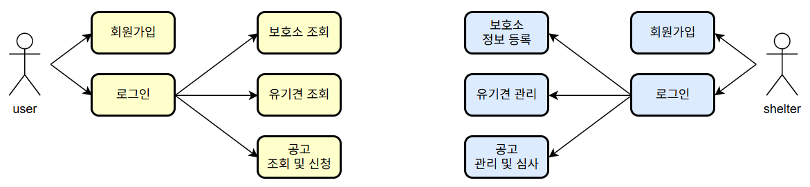

# Dogs Matching Platform

> 2025년 홍익대학교 소프트웨어융합학과 데이터베이스 팀 프로젝트
>
> PHP와 Oracle을 기반으로 유기견 입양 매칭 웹 서비스 플랫폼 개발

## 1. Member

- [C093299 홍민기](./https://github.com/mingimouse)
- [김건우](./https://github.com/Geon-NI)
- [정도영](https://github.com/JDoYoung)
- [천성호](https://github.com/BM00000001)

## 2. Overview

**Topic**: 유기견 보호소와 입양 희망자를 연결하는 **유기견 매칭 플랫폼**

- 일반 사용자는 다양한 조건으로 유기견을 조회하고 입양 신청을 할 수 있다.
- 보호소 사용자는 유기견 입양 공고를 등록, 수정, 심사, 삭제를 할 수 있다.

## 3. Database Design

## 4. Development

